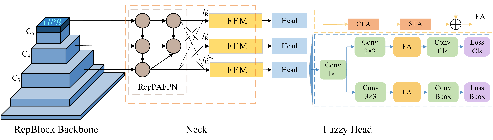

# F-YOLO

Code of paper *F-YOLO: Delving into Fuzzy YOLO for Improved Traffic Object Detection*



### Fuzzy Fusion Module
FFM is deployed to steer the fusion process, managing feature uncertainty during the fusion while achieving multi-scale feature fusion.


### Fuzzy Attention

The fuzzy attention mechanism consists of two distinct submodules: CFA and SFA. The former targets the mitigation and control of spatial dimension uncertainty, while the latter addresses similar concerns in the channel dimension.

#### CFA

Channel fuzzy attention employs fuzzy methodologies to evaluate each channel's contribution to the detection task.


#### SFA

 Spatial fuzzy attention focuses on the uncertainty of each position in feature space, rather than their values. 


### GPB

GPB is designed to more effectively assimilate global context information, which is composed by GhostBlock and Pooling Enhancement submodule.

## Installation

1. Pytorch==1.2.0
2. MMDetection==3.0.0, MMEngine==0.7.3
3. MMYOLO==0.5.0

For MMYOLO, please see https://mmyolo.readthedocs.io/

Placing files in our repository to the appropriate place as in MMYOLO, just overwrite or copy the new files is enough. 

> Caution:  make sure **all** files is downloaded and renewed, especially `__init__.py`s, `mmyolo/tools/analysis_tools` and `mmyolo/mmyolo/models/layers`

## Usage

Same as MMYOLO, please see [15 minutes to get started with MMYOLO object detection — MMYOLO 0.5.0 documentation](https://mmyolo.readthedocs.io/en/latest/get_started/15_minutes_object_detection.html#) and our config files are in `mmyolo/configs/yolov6s/`.

We used a very simple and intuitive way to present the code, with all modules plug and play.

#### train

```python
bash ./tool/dist_train.sh 2
```

#### inference

```python
# for val&test
python ./tool/test.py
```

#### benchmark

```python
python ./tool/analyze_logs/benchmark.py
python ./tool/analyze_logs/analyze_logs.py
python ./tool/analyze_logs/get_flops.py
```

## Result

##### TABLE I.  Experimental results on COCO *val2017* 

| Method     |   Backbone    |    AP    |   AP50   |   AP75   |   APS    |   APM    |   APL    |
| ---------- | :-----------: | :------: | :------: | :------: | :------: | :------: | :------: |
| PPYOLOEs   | CSPRepResNet  |   43.1   |   60.5   |   46.6   |   23.2   |   46.4   |   56.9   |
| YOLOv6s    | EfficientRep  |   43.5   |   60.4   |   46.8   |   23.7   |   48.9   |   59.9   |
| RTMDets    | Modified  CSP |   44.5   |   61.6   |   48.3   |   24.1   |   49.2   |   61.9   |
| YOLOv8s    | Modified  CSP |   44.2   |   61.1   |   47.9   |   25.9   |   49.1   |   60.1   |
| DAMO-YOLOs |    MAE-NAS    |   46.0   |   61.9   |   49.5   |   25.9   |   50.6   |   62.5   |
| YOLO-MSs   |   MS-Block    | **46.2** |   63.7   |   50.5   | **26.9** |   50.5   |   63.0   |
| Ours       | EfficientRep  | **46.2** | **65.5** | **51.0** |   25.9   | **52.4** | **64.4** |

##### TABLE II.  Experimental results on VisDrone2017

| Method    |       Backbone        |    AP    |   AP50   |   AP75   |   APS    |   APM    | APL      |
| :-------- | :-------------------: | :------: | :------: | :------: | :------: | :------: | -------- |
| YOLOXs    |     Modified  CSP     |   17.6   |   33.9   |   16.2   |   9.0    |   27.7   | 45.0     |
| YOLOv6s   |     EfficientRep      |   19.5   |   33.2   |   19.5   |   9.7    |   30.8   | 47.4     |
| PPYOLOEs  |     CSPRepResNet      |   20.0   |   34.6   |   20.0   |   10.5   |   31.5   | 51.0     |
| UAV-YOLO  | Modified  CSP(YOLOv5) |   20.6   |   37.6   |    -     |    -     |    -     | -        |
| YOLOv8s   |  Modified  CSP(C2f)   |   20.9   |   36.8   |   20.7   |   10.7   |   33.2   | 49.7     |
| FE-YOLOv5 | Modified  CSP(YOLOv5) |   21.0   |   37.0   |   20.7   | **13.2** |   29.5   | 39.1     |
| Ours      | EfficientRep(YOLOv6)  | **23.4** | **38.2** | **24.2** |   11.3   | **37.6** | **59.1** |

##### TABLE III.  Experimental results on UA-DETRAC

| Method      |      Backbone      |    AP    |   AP50   |   AP75   |   APS   |   APM    |   APL    | FLOPs |
| :---------- | :----------------: | :------: | :------: | :------: | :-----: | :------: | :------: | :---: |
| FasterRCNN  |       ResNet       |   38.8   | **66.3** |   40.3   |   3.9   |   28.9   |   43.7   | 60.5  |
| RetinaNet   |       ResNet       |   32.1   |   56.6   |   33.8   |   2.1   |   22.8   |   46.8   | 45.2  |
| CascadeRCNN |       ResNet       |   41.1   |   65.2   |   46.4   |   3.8   |   27.5   |   57.1   | 88.1  |
| ATSS        |       ResNet       |   32.1   |   58.8   |   31.0   |   4.1   |   24.0   |   45.1   | 49.2  |
| YOLOv5s     |   Modified  CSP    |   44.9   |   62.0   |   51.8   |   5.2   |   34.7   |   56.2   | 17.1  |
| YOLOXs      |   Modified  CSP    |   40.0   |   56.2   |   46.6   |   3.4   |   28.8   |   49.6   | 26.8  |
| PPYOLOEs    |    CSPRepResNet    |   43.7   |   55.3   |   51.1   |   1.1   |   28.8   |   53.5   | 17.4  |
| YOLOv6s     |    EfficientRep    |   43.0   |   59.0   |   49.9   |   4.2   |   29.7   |   58.7   | 43.8  |
| YOLO7tiny   |   Extended-ELAN    |   43.4   |   62.8   |   50.6   |   4.1   | **32.6** |   57.2   | 13.1  |
| YOLOv8s     | Modified  CSP(C2f) | **46.9** |   62.6   |   52.9   |   3.9   |   31.4   |   58.7   | 28.6  |
| Ours        |    EfficientRep    |   46.7   |   61.1   | **54.9** | **9.0** |   27.4   | **59.2** | 44.3  |

##### TABLE IV.  mAP of different classes in BDD100K

| Models   | Ped  | Rider | Car  | Truck | Bus  | Train | Bicycle |  TL  |  TS  |
| :------- | ---- | :---: | :--: | :---: | :--: | :---: | :-----: | :--: | :--: |
| PPYOLOEs | 55.3 | 37.2  | 76.3 | 61.4  | 60.4 |  0.0  |  42.9   | 57.6 | 66.1 |
| YOLOv6s  | 59.6 | 42.0  | 77.4 | 61.8  | 59.6 |  0.0  |  40.6   | 58.3 | 61.9 |
| YOLOv8s  | 62.2 | 45.9  | 79.8 | 64.0  | 61.4 |  0.6  |  44.0   | 62.3 | 65.4 |
| Ours     | 62.9 | 46.2  | 79.4 | 64.1  | 62.0 |  7.0  |  44.5   | 61.9 | 65.7 |

##### TABLE V.  Ablation study

| FA   | FFM  | GPB  |  AP  | AP50 | AP75 | APS  | APM  | APL  |
| ---- | :--: | :--: | :--: | :--: | :--: | :--: | :--: | :--: |
|      |      |      | 43.5 | 60.4 | 46.8 | 23.7 | 48.9 | 59.9 |
|      |      |  √   | 44.0 | 61.9 | 48.2 | 23.6 | 49.2 | 61.0 |
|      |  √   |      | 44.9 | 62.6 | 48.4 | 24.6 | 49.8 | 62.5 |
| √    |      |      | 44.5 | 62.3 | 47.9 | 24.4 | 49.1 | 62.8 |
| √    |  √   |      | 45.7 | 63.5 | 49.1 | 25.4 | 50.3 | 65.0 |
| √    |  √   |  √   | 46.2 | 65.5 | 51.0 | 25.9 | 52.4 | 64.4 |

<details> 
    <summary>①</summary>
    The F-YOLO model are trained from scratch on the MS COCO and UA-DETRAC datasets for 300 epochs, without relying on any baseline model checkpoints. Subsequent fine-tuning was carried out on the VisDrone2019 and BDD100K datasets for 50 and 100 epochs, respectively.  
</details>
<details> 
    <summary>②</summary>
    Train and test on 2 NVIDIA GeForce RTX 3090 GPUs.
</details>

## Models

Pretrained checkpoint will coming soon.

| model             | epoch | AP   | config file                                                  | download                                                     |
| ----------------- | ----- | ---- | ------------------------------------------------------------ | ------------------------------------------------------------ |
| F-YOLO_coco       | 300   | 46.2 | [cfg](https://github.com/JamesYang568/F-YOLO/blob/main/mmyolo/configs/yolov6/yolov6_s_all_2xb32-300e_coco.py) | [link]                                                       |
| F-YOLO_visdrone   | 100   | 23.4 | [cfg](https://github.com/JamesYang568/F-YOLO/blob/main/mmyolo/configs/yolov6/yolov6_s_all_1xb32-100e_visdrone.py) | [link]                                                       |
| F-YOLO_bdd        | 100   | 32.2 | [cfg](https://github.com/JamesYang568/F-YOLO/blob/main/mmyolo/configs/yolov6/yolov6_s_all_2xb32-100e_bdd.py) | [link]                                                       |
| F-YOLO_ua-detrac  | 300   | 46.7 | [cfg](https://github.com/JamesYang568/F-YOLO/blob/main/mmyolo/configs/yolov6/yolov6_s_all_2xb32-300e_uadetrca.py) | [link]                                                       |
| yolox_ua-detrca   | 300   | 40.0 | [cfg](https://github.com/JamesYang568/F-YOLO/blob/main/mmyolo/configs/yolox/yolox_s_fast_uadetrca.py) | [link]                                                       |
| PPYOLOE_ua-detrac | 100   | 43.7 | [cfg](https://github.com/JamesYang568/F-YOLO/blob/main/mmyolo/configs/ppyoloe/ppyoloe_plus_s_uadetrca.py) | [link]                                                       |
| PPYOLOE_bdd       | 100   | 29.2 | [cfg](https://github.com/JamesYang568/F-YOLO/blob/main/mmyolo/configs/ppyoloe/ppyoloe_plus_s_bdd.py) | [link]                                                       |
| YOLOv6_coco       | 300   | 43.5 | [cfg](https://github.com/JamesYang568/F-YOLO/blob/main/mmyolo/configs/yolov6/yolov6_s_syncbn_fast_8xb32-300e_coco.py) | [link](链接：https://pan.baidu.com/s/1sqhWYCFx47xRgZw6sWfl9Q)  code:` hwpt` |
| YOLOv6_bdd        | 100   | 29.7 | [cfg](https://github.com/JamesYang568/F-YOLO/blob/main/mmyolo/configs/yolov6/yolov6_s_2xb32-100e_bdd.py) | [link]                                                       |
| YOLOv6_ua-detrac  | 300   | 43.0 | [cfg](https://github.com/JamesYang568/F-YOLO/blob/main/mmyolo/configs/yolov6/yolov6_s_2xb32-300e_uadetrca.py) | [link]                                                       |
| YOLOv8_visdrone   | 100   | 20.9 | [cfg](https://github.com/JamesYang568/F-YOLO/blob/main/mmyolo/configs/yolov8/yolov8_s_visdrone.py) | [link]                                                       |
| YOLOv8_bdd        | 100   | 31.5 | [cfg](https://github.com/JamesYang568/F-YOLO/blob/main/mmyolo/configs/yolov8/yolov8_s_bdd100k.py) | [link]                                                       |

## Contact

jiaxiongyang at tongji dot edu dot cn
